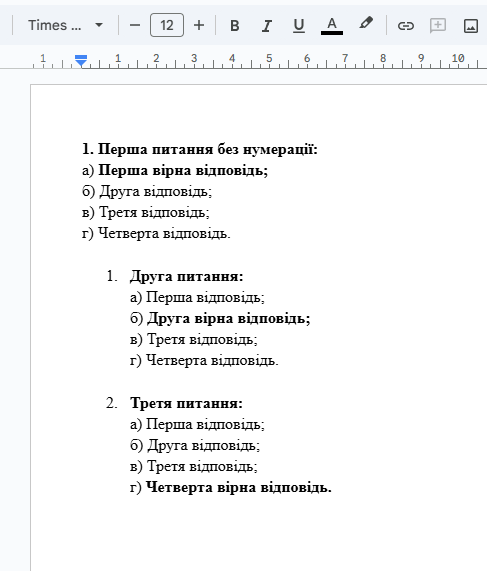
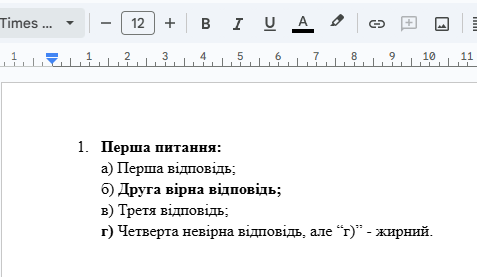

# Поширені запитання

Якщо тут немає відповіді на ваше запитання — зверніться до лаборанта у Навчальному корпусі №1, ауд. 104. Він допоможе відповісти на питання, а якщо виникла технічна проблема з програмою — може виправити її та оновити програму.

Якщо у вас є нові ідеї щодо покращення — також повідомте лаборанта.

## Проблеми з аналізом документа

### Неправильна нумерація запитань

Програма аналізує кожне запитання за наявністю нумерації. Якщо питання не пронумероване — воно не буде відображене в інтерфейсі програми. Наприклад:

### Неправильне форматування правильної відповіді

Правильна відповідь повинна бути повністю виділена **жирним шрифтом**. Якщо жирним виділено лише частину рядка (наприклад, `а)` жирна, а текст відповіді — ні), програма може не розпізнати її правильно. Приклад:

### Не всі правильні відповіді відображаються

Іноді у певних версіях Microsoft Word документ зберігається некоректно, через що програма не може визначити правильні відповіді. У такому випадку:
- Вручну оберіть правильну відповідь у візуальному редакторі;
- Або спробуйте перезберегти DOCX у Google Документах або іншому редакторі DOCX.
