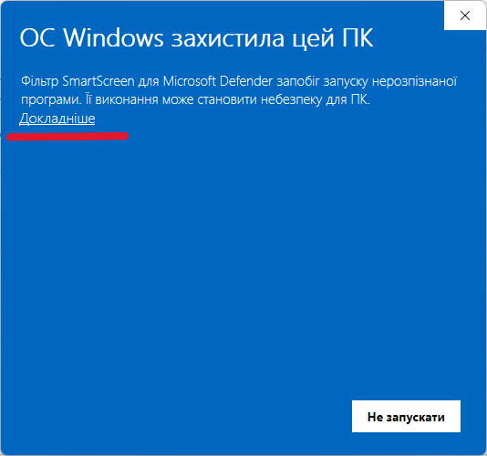
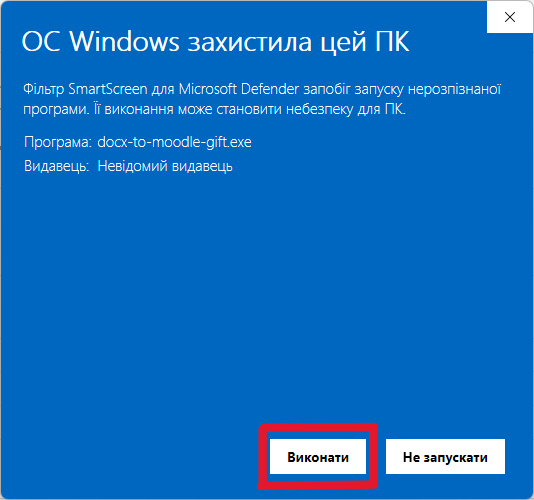
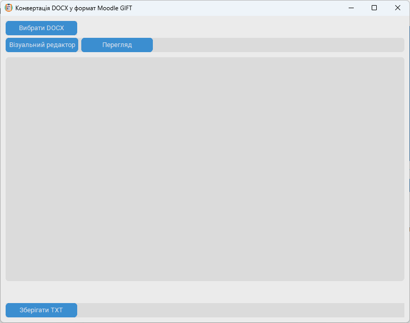

# Початок роботи

Познайомлення роботу програми.

## Система вимоги

Програма працюватиме тільки в сучасній операційній системи з Windows 10, лаборант пробував реалізувати для ранні версії Windows 7, це не вийшло, нажаль.

## Перший запуск програми

1. Завантажувати програму [docx-to-moodle-gift.exe](https://github.com/yuranebykov/docx-to-moodle-gift/releases/download/v1.0.0/docx-to-moodle-gift.exe)
2. Запуск програми, у Вас буде виникнення вікно:

3. Натисніть **"Докладніше"**, бо такий Windows не може розпізнати хто видавець з публічних компанії.

4. Натисніть кнопку **"Виконати"**.
5. (Додатково) Якщо у Вас виникли проблеми, то зверніться до лаборанта у Навчальному корпусі №1, ауд. 104.

## Ознайомлення з інтерфейсом

Програма дозволяє аналізувати список питань із документа у форматі DOCX — для цього натисніть кнопку **«Вибрати DOCX»**.

Після натискання на **«Вибрати DOCX»**, нижче з’явиться список питань. Існує два режими відображення:

- **«Візуальний редактор»** — можна вибрати одну правильну відповідь.
- **«Перегляд»** — показує текст у форматі GIFT (загальний шаблон імпорту, англ. *General Import Format Template*).

Щоб отримати список питань у форматі GIFT, натисніть **«Зберігати TXT»** — отриманий файл можна імпортувати на платформу Moodle.

На наступній сторінці — інструкція щодо структури тексту у DOCX, який програма може аналізувати.
