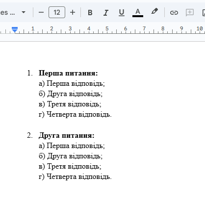
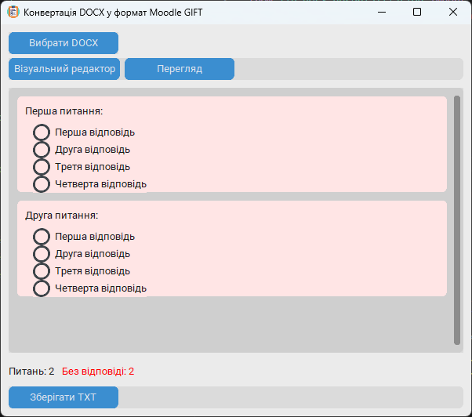
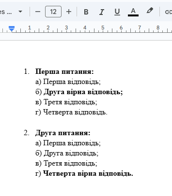

# Структура тексту у DOCX

## Базовий аналіз документа DOCX

Усі питання повинні бути пронумеровані, щоб програма могла аналізувати документ DOCX. Наприклад, як на скріншоті:

Варіанти відповідей повинні починатися з великих літер: `А)`, `Б)`, `В)`, `Г)`, або малих літер: `а)`, `б)`, `в)`, `г)`. Програма автоматично видаляє ці префікси, а також символи `;` і `.` наприкінці рядка.

Після натискання кнопки **"Вибрати DOCX"** інтерфейс виглядатиме так:

У **"Візуальному редакторі"** відповіді можуть бути без визначеної правильної. Потрібно вручну вибрати правильну відповідь, натиснувши на кружечок біля неї. Після цього можна зберегти файл у форматі GIFT, натиснувши кнопку **"Зберігати TXT"**.

## Автоматичний аналіз документа DOCX з правильними відповідями

Програма також може автоматично визначити правильні відповіді, якщо вони виділені жирним шрифтом. Наприклад:

## Проблеми під час аналізу документа DOCX

Якщо структура тексту неправильна (наприклад, відсутня нумерація питань), програма не зможе розпізнати такі питання. У разі виникнення інших проблем зверніться до сторінки **"Поширені запитання"**. Якщо там немає відповіді — зверніться до лаборанта у Навчальному корпусі №1, ауд. 104.
